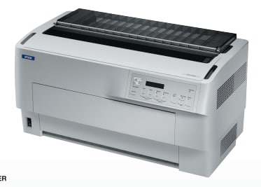

# LA IMPRESORA

## EPSON DFX-9000

[Especificaciones y Caracteristicas Generales](https://github.com/mmhgarcia/impresion_data_variable/blob/master/ESPECIFICACIONES%20TECNICAS%20IMPRESORA%20MATRICIAL%20EPSON%20PARA%20PRODUCCION.rar)

[Manual del Programador, Comandos de Fábrica y Secuencias de Escape](https://github.com/mmhgarcia/impresion_data_variable/blob/master/MANUAL%20DE%20COMANDOS%20DE%20PROGRAMACION%20IMPRESORAS%20MATRICIALES%20EPSON.rar)

Espero que esta información le sirva de guía y marco referencial para sus procesos de producción.

#### Caso de dudas, preguntas o si requiere servicio de consultoría, puede contactarme via instagram: @impresiondatavariable

👍

